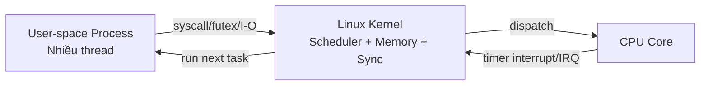
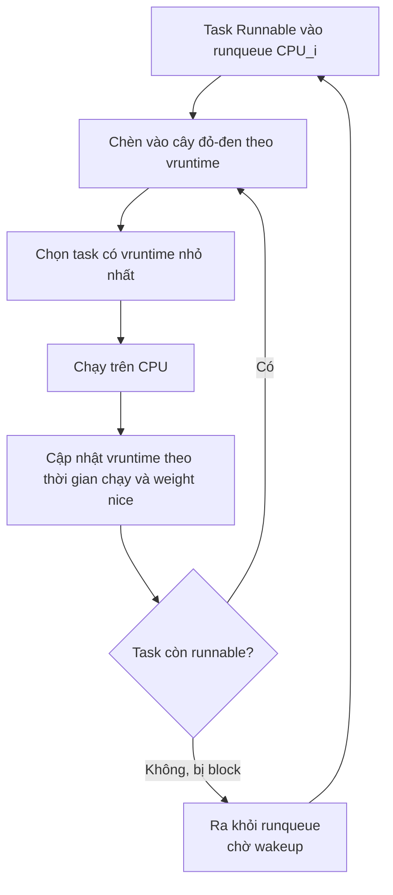
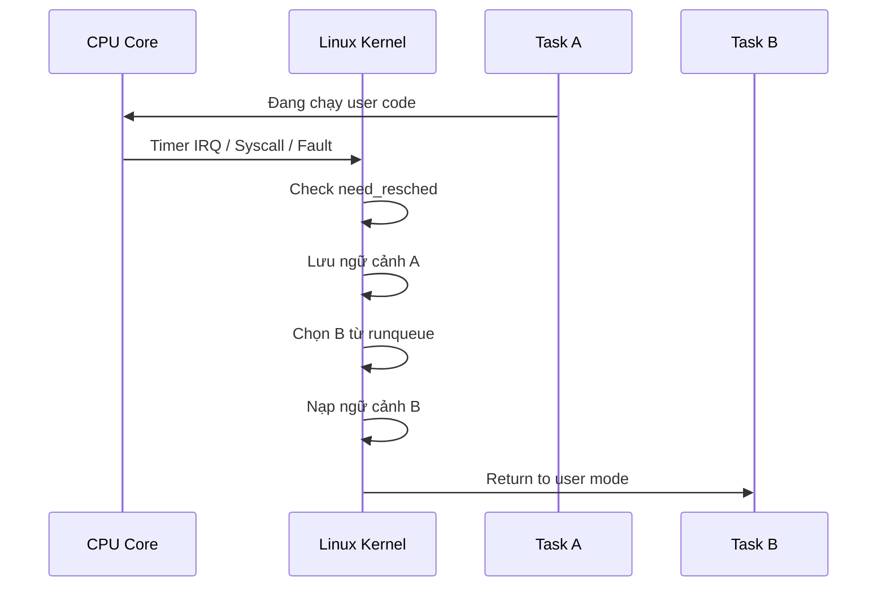
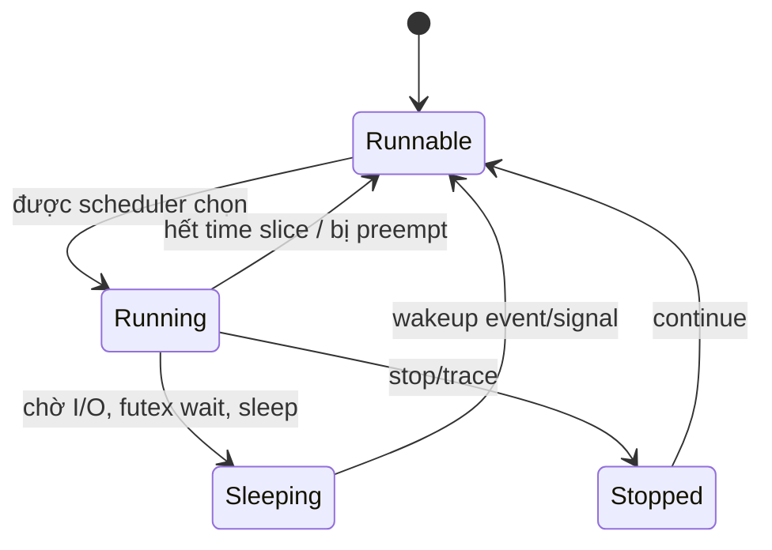
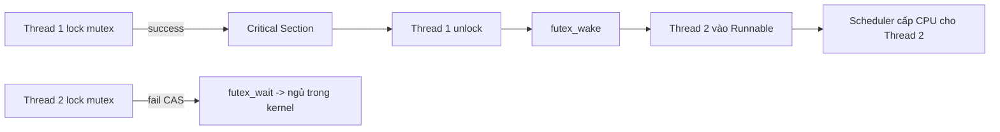

# Multithreading trong Linux - Deep Dive (Không bàn code C++ ở phần này)

## 1) Mục tiêu học phần này

Tài liệu này tập trung vào bản chất hệ thống:

- CPU thực sự chạy thread như thế nào.
- Kernel Linux quản lý process và thread ra sao.
- Scheduler quyết định ai chạy, chạy khi nào.
- Context switch diễn ra theo từng bước nào và tốn chi phí gì.
- Vì sao multithread có lúc tăng tốc, có lúc chậm hơn single-thread.

Không đi vào cách viết API C++ tạo thread. Trọng tâm là cơ chế nền tảng của Linux system.

---

## 2) Bức tranh tổng thể

Multithreading trên Linux là phối hợp của 3 lớp:

1. Phần cứng CPU: core, cache, TLB, interrupt, chế độ user/kernel.
2. Linux kernel: scheduler, task management, memory management, sync primitives.
3. User-space process: ứng dụng tạo nhiều luồng thực thi, kernel quyết định lịch chạy.

Kết luận quan trọng:

- Linux không có một thực thể thread tách biệt hoàn toàn với process theo kiểu triết học.
- Linux có đơn vị lập lịch là task.
- Process và thread đều là task, khác nhau chủ yếu ở mức độ chia sẻ tài nguyên.

### Sơ đồ tổng quan 3 lớp (CPU -> Kernel -> User-space)

---

## 3) Process và Thread trong Linux: góc nhìn kernel

### 3.1 Đơn vị lõi là task

Kernel theo dõi thực thể chạy bằng cấu trúc đại diện task (thực tế là task_struct).

Mỗi task có:

- Tập thanh ghi lưu trạng thái chạy.
- Trạng thái scheduler (running, runnable, sleeping...).
- Kernel stack riêng.
- Metadata về tín hiệu, ưu tiên, affinity, accounting.

### 3.2 Process vs Thread là khác biệt chia sẻ tài nguyên

Các task trong cùng một process thường chia sẻ:

- Không gian địa chỉ ảo (mm_struct).
- Bảng file descriptor.
- Trình xử lý signal (nhiều phần).
- Thư mục làm việc, thông tin filesystem context.

Điều này nghĩa là:

- Thread cùng process có thể đọc/ghi chung vùng nhớ user-space.
- Chuyển đổi giữa thread cùng process thường rẻ hơn so với đổi process khác không gian địa chỉ.
- Nhưng vẫn có overhead scheduler và tác động cache/TLB.

---

## 4) CPU nhìn thấy gì khi chạy multithread

### 4.1 Một core chạy gì tại một thời điểm

- Một core vật lý tại một thời điểm chỉ retire chuỗi lệnh của một luồng phần cứng.
- Nếu có SMT/Hyper-Threading, một core vật lý có thể có nhiều logical CPU, nhưng vẫn chia sẻ tài nguyên nội bộ.

### 4.2 Hai kiểu đồng thời

1. Parallel thực: thread chạy trên các core khác nhau cùng lúc.
2. Interleaving theo thời gian: cùng một core, kernel chuyển context rất nhanh.

### 4.3 User mode và Kernel mode

- User mode: chạy mã ứng dụng.
- Kernel mode: xử lý syscall, interrupt, fault, scheduler.

Mọi quyết định lập lịch và context switch đều nằm trong kernel mode.

---

## 5) Scheduler Linux: ai được chạy và vì sao

Linux có nhiều scheduling class. Trực giác mức ưu tiên:

1. Deadline class.
2. Real-time class (FIFO/RR).
3. CFS class cho tác vụ thông thường.

Phần lớn app bình thường chạy ở CFS.

### 5.1 CFS (Completely Fair Scheduler)

Ý tưởng:

- Mỗi CPU có runqueue riêng.
- Task runnable được theo dõi bằng virtual runtime (vruntime).
- Task có vruntime nhỏ hơn sẽ được ưu tiên để giữ công bằng.

Công bằng ở đây là công bằng theo trọng số (nice), không phải chia chính xác từng mili-giây tuyệt đối.

### 5.2 Load balancing

- Vì mỗi CPU có runqueue riêng, kernel phải cân bằng tải giữa các CPU.
- Khi migrate task sang CPU khác, có thể tăng chi phí do mất locality cache.

### Sơ đồ lập lịch CFS (đơn giản hóa)

---

## 6) Context switch: từng bước diễn ra trong kernel

Một context switch điển hình:

1. CPU nhận timer interrupt hoặc thread đi vào kernel qua syscall/fault.
2. Kernel cập nhật accounting thời gian chạy task hiện tại.
3. Kernel kiểm tra cờ cần reschedule.
4. Scheduler chọn task kế tiếp từ runqueue.
5. Lưu state task cũ (register, stack pointer, metadata liên quan).
6. Nạp state task mới.
7. Chuyển sang task mới và quay lại user mode nếu cần.

### Sơ đồ context switch theo dòng thời gian

### 6.1 Khi nào context switch xảy ra nhiều

- Thread thường xuyên block I/O.
- Nhiều lock contention.
- Số thread runnable vượt xa số logical CPU.
- Time slice nhỏ và workload ngắt quãng.

### 6.2 Chi phí của context switch

Chi phí không chỉ là save/restore register.

Bao gồm:

- Scheduler decision overhead.
- Cache disturbance (working set mới chưa nóng cache).
- TLB effects.
- CPU migration penalty (nếu đổi core).

Mô hình gần đúng:

T_switch = T_save_restore + T_sched + T_cache + T_tlb + T_migration

---

## 7) Memory, MMU, TLB và ảnh hưởng đến multithread

### 7.1 Virtual memory và address translation

Ứng dụng truy cập địa chỉ ảo. MMU dịch sang địa chỉ vật lý qua page table.
TLB cache kết quả dịch gần đây để truy cập nhanh.

### 7.2 Vì sao thread có thể nhanh hơn process ở vài trường hợp

Thread cùng process chia sẻ address space:

- Truy cập dữ liệu chung trực tiếp.
- Không cần IPC nặng chỉ để truyền dữ liệu nội bộ.

Nhưng điều này cũng tăng rủi ro:

- Data race.
- False sharing.
- Cache coherence traffic lớn.

### 7.3 False sharing (điểm đau hay gặp)

Hai thread ghi hai biến khác nhau nhưng cùng nằm trên một cache line:

- Cache line bị invalidate qua lại giữa core.
- Hiệu năng giảm mạnh dù không tranh chấp lock logic.

---

## 8) Trạng thái task trong Linux (mức học bản chất)

Các trạng thái trực giác cần nhớ:

- Running: đang thực thi trên CPU.
- Runnable: sẵn sàng chạy, chờ CPU.
- Sleeping interruptible: ngủ, có thể bị đánh thức bởi sự kiện/signal.
- Sleeping uninterruptible: thường chờ I/O sâu.
- Stopped/Traced: bị dừng hoặc debug.

Vòng đời thường gặp của thread server:

Runnable -> Running -> Blocked (I/O hoặc futex wait) -> Runnable (wake) -> Running

### Sơ đồ trạng thái thread/task

---

## 9) Đồng bộ đa luồng: tại sao kernel vẫn xuất hiện dù bạn lock ở user-space

### 9.1 Atomic trước, kernel sau

Nhiều primitive lock hiện đại dùng chiến lược:

1. Fast path ở user-space bằng atomic.
2. Chỉ khi contention mới gọi vào kernel (thường qua futex).

### 9.2 Futex là điểm nối user-space và scheduler

Khi lock bị tranh chấp:

- Thread thua đi ngủ trong kernel queue.
- Thread unlock sẽ wake thread cần thiết.

Tức là lock contention trực tiếp biến thành context switch + scheduler work.

### Sơ đồ futex wait/wake (khi có contention)

---

## 10) Vì sao oversubscription làm hệ thống ì

Oversubscription: số thread runnable nhiều hơn số logical CPU đáng kể.

Hệ quả:

- Context switch dày.
- Cache miss tăng.
- Độ trễ tail latency xấu đi.
- Throughput có thể không tăng, thậm chí giảm.

Quy tắc trực giác:

- CPU-bound workload: số worker gần số logical CPU (hoặc thấp hơn chút) thường tốt hơn.
- I/O-bound workload: có thể nhiều thread hơn, nhưng vẫn phải đo thực tế.

---

## 11) NUMA và CPU affinity: phần nâng cao nhưng cực quan trọng

Trên máy nhiều socket hoặc NUMA node:

- Truy cập RAM local node nhanh hơn remote node.
- Thread migrate giữa node có thể làm dữ liệu không còn local.

Kỹ thuật vận hành:

- Pin thread theo CPU set trong vài hệ thống low-latency.
- Giữ dữ liệu gần nơi thread chạy để tăng locality.

---

## 12) Ảnh hưởng của interrupt lên scheduling

Interrupt có thể preempt luồng hiện tại để xử lý sự kiện phần cứng.

Chuỗi tác động:

1. IRQ đến.
2. CPU vào kernel handler.
3. Có thể wake task đang ngủ chờ event.
4. Scheduler đánh giá có cần chuyển task ngay không.

Nên latency của app không chỉ do code app, mà còn do nhiễu interrupt và chính sách scheduling.

---

## 13) Mô hình tư duy đúng để học sâu multithreading

Thay vì nghĩ "thread tự chạy", hãy nghĩ:

1. Thread chỉ là task đang cạnh tranh quyền dùng CPU.
2. Scheduler quyết định quyền chạy theo policy và trạng thái hệ thống.
3. Mọi block/wakeup đều là tín hiệu làm thay đổi đồ thị lập lịch.
4. Hiệu năng là tổng hợp của scheduler + memory hierarchy + sync design.

---

## 14) Những ngộ nhận phổ biến

1. "Tăng thread luôn nhanh hơn"
- Sai. Có giới hạn song song hóa và overhead.

2. "Thread switch gần như miễn phí"
- Sai. Switch có chi phí trực tiếp và gián tiếp qua cache/TLB.

3. "Thread cùng process thì không cần đồng bộ"
- Sai. Chia sẻ bộ nhớ càng cần đồng bộ đúng cách.

4. "CPU 8 core thì cứ 100 thread CPU-bound"
- Thường phản tác dụng vì oversubscription.

---

## 15) Khung phân tích hiệu năng đa luồng trên Linux (không cần code)

Khi thấy app đa luồng chậm, phân tích theo thứ tự:

1. Thread đang CPU-bound hay I/O-bound?
2. Số runnable thread so với số logical CPU?
3. Có lock contention cao không?
4. Context switch rate có quá lớn không?
5. Có migration liên tục giữa CPU không?
6. Có dấu hiệu cache miss/false sharing?
7. Có NUMA remote memory access cao?

---

## 16) Kết nối với phần Process/IPC bạn đang học

Bạn đang học Unix socket, shared memory, signals, network socket.
Đây là điểm giao rất quan trọng với multithreading:

- Thread nào block trên recv/select sẽ đi vào trạng thái ngủ và nhường CPU.
- Event I/O đến sẽ wake thread tương ứng.
- Nếu một process dùng nhiều thread xử lý I/O + worker compute, scheduler sẽ liên tục cân bằng giữa nhóm thread này.

Nói cách khác, IPC/I-O chính là "nguồn kích hoạt" gây block/wakeup, và block/wakeup chính là nhịp tim của multithread runtime.

---

## 17) Roadmap học tiếp (phần siêu sâu)

Gợi ý lộ trình 4 tầng:

1. Tầng scheduler internals:
- Runqueue per-CPU, vruntime, wakeup preemption, load balancing.

2. Tầng memory internals:
- TLB, page fault, cache coherence, false sharing, NUMA locality.

3. Tầng synchronization internals:
- Atomic memory ordering, futex wait/wake path, lock convoy.

4. Tầng observability thực chiến:
- Đo context switch, runqueue latency, CPU migration, lock contention.

---

## 18) Tóm tắt một câu

Multithreading trên Linux là bài toán cấp phát CPU time cho nhiều task cạnh tranh nhau, trong đó hiệu năng thực tế được quyết định bởi scheduler policy, hành vi block/wakeup, và chất lượng locality của bộ nhớ/cache nhiều hơn là bởi việc "tạo được bao nhiêu thread".
