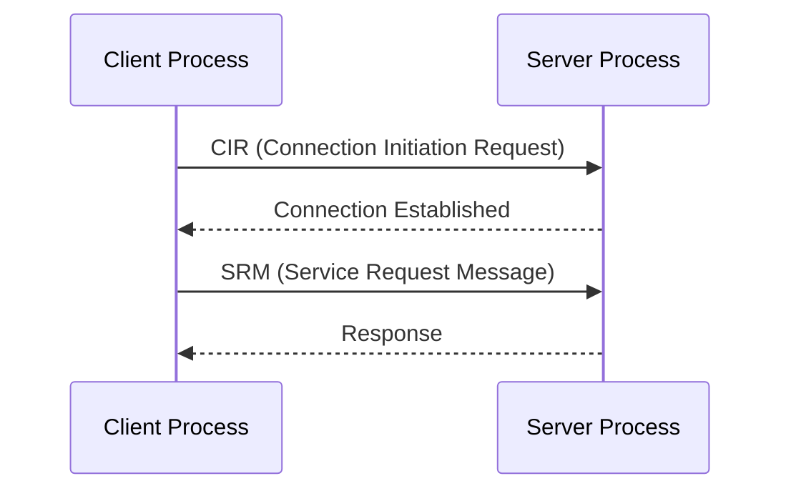
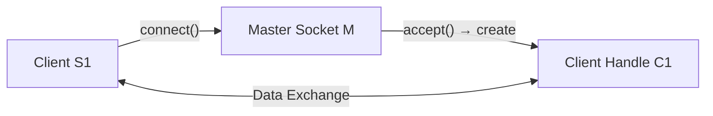
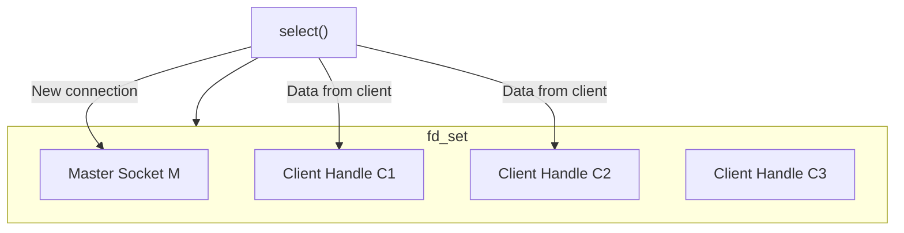

# Unix Domain Socket (UDS)

## 1. Sockets

Unix/Linux like OS provide **Socket interface** to carry out communication between various types of entities.

The Socket Interface are a bunch of Socket programming related APIs. We shall be using these APIs to implement the Sockets of various types.

## 2. Two Types

| Type | Scope | Use Case |
|------|-------|----------|
| **Unix Domain Sockets (UDS)** | IPC between processes on the **SAME** machine | ← FOCUS |
| **Network Sockets (TCP/UDP)** | Communication between processes on **different** machines over the network | |

## 3. Socket Message Types



Categorized 2 message types:
- **CIR** — Connection Initiation Request messages
- **SRM** — Service Request Messages: only client can send SRM to server once the connection is fully established.

> Servers identify and process both types of messages very differently.

## 4. Socket Design (State Machine of Client-Server Communication)

When Server boots up, it creates a **connection socket** (also called **Master Socket File Descriptor**):

```c
M = socket();  // Master socket fd
```



**Key concepts:**
- `M` is the **mother** of all Client Handles. `M` gives birth to all Client Handles (data sockets).
- `M` is **only** used to create new client handles — NOT for data exchange with already connected clients.
- `accept()` is the system call used on server side to create client handles.
- Handles are called **file descriptors** — positive integers (`int fd > 0`).

| Term | Also known as |
|------|---------------|
| `M` | Master socket fd, Connection socket |
| `C1, C2, ...` | Client Handles, Communication fd, Data Sockets |

## 5. Unix Domain Sockets (UDS)

- UDS is used for IPC between 2 processes running on the **SAME** machine (Client ↔ Server).
- Using UDS, we can setup **STREAM** or **DATAGRAM** based communication:

| Mode | Use Case | Characteristics |
|------|----------|-----------------|
| **STREAM** | Large files, important data | Ensures correct sequence, reliable (e.g., control signals) |
| **DATAGRAM** | Small units, large quantities continuously | Some data might be lost, doesn't affect overall (e.g., video stream) |

## 6. Multiplexing IO

Multiplexing is a mechanism through which the Server can **monitor multiple clients at the same time**.



- `select()` — monitor all clients activity at the same time.
- Server must maintain:
  - **Client Handles** (communication FDs) for data exchange with connected clients.
  - **Connection Socket** (Master socket FD `M`) to process new connection requests.
- Linux provides `fd_set` — an inbuilt data structure to maintain the set of socket file descriptors.
- `select()` system call monitors all socket FDs present in `fd_set` (`M`, `C1`, `C2`, ...).
