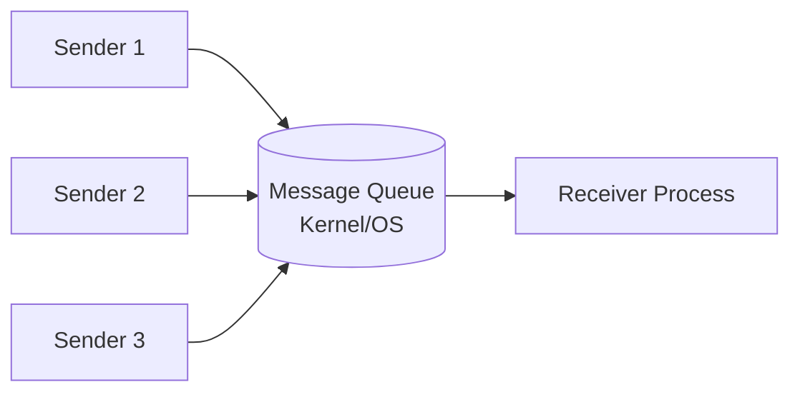

# Message Queue

## 1. Overview

- A Message Queue is identified uniquely by an **ID** (which is a string). It resides and is managed by the **Kernel/OS**.
- A process can create a new message queue or use an existing one created by another process.


## 2. Message Queue Creation — `mq_open()`

```c
mqd_t mq_open(const char* name, int oflag);
mqd_t mq_open(const char* name, int oflag, mode_t mode, struct mq_attr *attr);
```

If `mq_open()` succeeds, it returns a **file descriptor** (handle) to the message queue.

### Parameters

| Parameter | Description |
|-----------|-------------|
| `name` | Unique name, e.g., `"/server-msg-q"`, `"/mq/msgqueue"` |
| `oflag` | Operational flags (see below) |
| `mode` | Permissions, usually `0660` |
| `attr` | Attributes of the queue being created |

### Operational Flags (`oflag`)

| Flag | Meaning |
|------|---------|
| `O_RDONLY` | Process can only **read** msgs from queue |
| `O_WRONLY` | Process can only **write** msgs into queue |
| `O_RDWR` | Process can read and write |
| `O_CREAT` | Create the queue if it doesn't exist |
| `O_EXCL` | `mq_open()` **fails** if queue already exists |

### Attributes Structure

```c
struct mq_attr {
    long mq_flags;      // Flags: 0
    long mq_maxmsg;     // Max number of messages on queue
    long mq_msgsize;    // Max size (bytes) of a message
    long mq_curmsgs;    // Number of msgs currently in queue
};
```

### Examples

```c
// Simple creation
mqd_t msgq = mq_open("/server-msg-q", O_RDONLY | O_CREAT | O_EXCL, 0660, 0);

// With attributes
struct mq_attr attr;
attr.mq_flags   = 0;
attr.mq_maxmsg  = 10;
attr.mq_msgsize = 4096;
attr.mq_curmsgs = 0;

mqd_t msgq = mq_open("/server-msg-q", O_RDONLY | O_CREAT | O_EXCL, 0660, &attr);
```

## 3. Message Queue Closing — `mq_close()`

```c
int mq_close(mqd_t msgQ);
```

- OS tracks `reference_count` (number of processes that opened the queue via `mq_open()`).
- When `reference_count == 0` → Kernel removes and destroys the message queue.

## 4. Enqueue a Message — `mq_send()`

```c
int mq_send(mqd_t msgQ, char* msg_ptr, size_t msg_len, unsigned int msg_prio);
```

| Parameter | Description |
|-----------|-------------|
| `msg_ptr` | The message buffer |
| `msg_len` | Size of message (≤ `mq_msgsize`) |
| `msg_prio` | Priority (≥ 0). Messages ordered by **decreasing** priority |

> **Blocking behavior:** If the queue is **FULL**, `mq_send()` blocks until there is space — unless `O_NONBLOCK` is set, in which case it returns immediately with `errno = EAGAIN`.

## 5. Dequeue a Message — `mq_receive()`

```c
int mq_receive(mqd_t msgQ, char* msg_ptr, size_t msg_len, unsigned int *msg_prio);
```

| Parameter | Description |
|-----------|-------------|
| `msg_ptr` | Points to empty message buffer |
| `msg_len` | Size of the buffer in bytes |
| `msg_prio` | If not NULL, receives the priority of the dequeued message |

- The **oldest** message of the **highest priority** is deleted from the queue and passed to the process.
- Returns: number of bytes received in `msg_ptr`.

> **Blocking behavior:** If the queue is **EMPTY**, `mq_receive()` blocks — unless `O_NONBLOCK` is set, in which case it returns immediately with `errno = EAGAIN`.

## 6. Using as an IPC

Message Queue supports **N:1** communication paradigm — N senders, 1 receiver per queue.



- Receiving process can dequeue messages from **different** message queues at the same time → **Multiplexing** using `select()`.

> **NOTE:** Khi một Message Queue đang được một process sử dụng `mq_receive()` block thì các process khác sẽ không chen chân vào được. Vì vậy, process muốn nhận msg phải tự tạo ra một MsgQ riêng và block `mq_receive()`.
