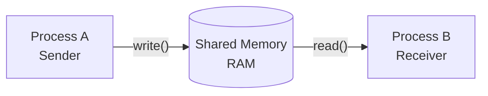
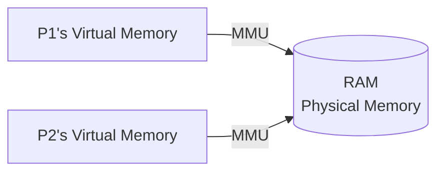
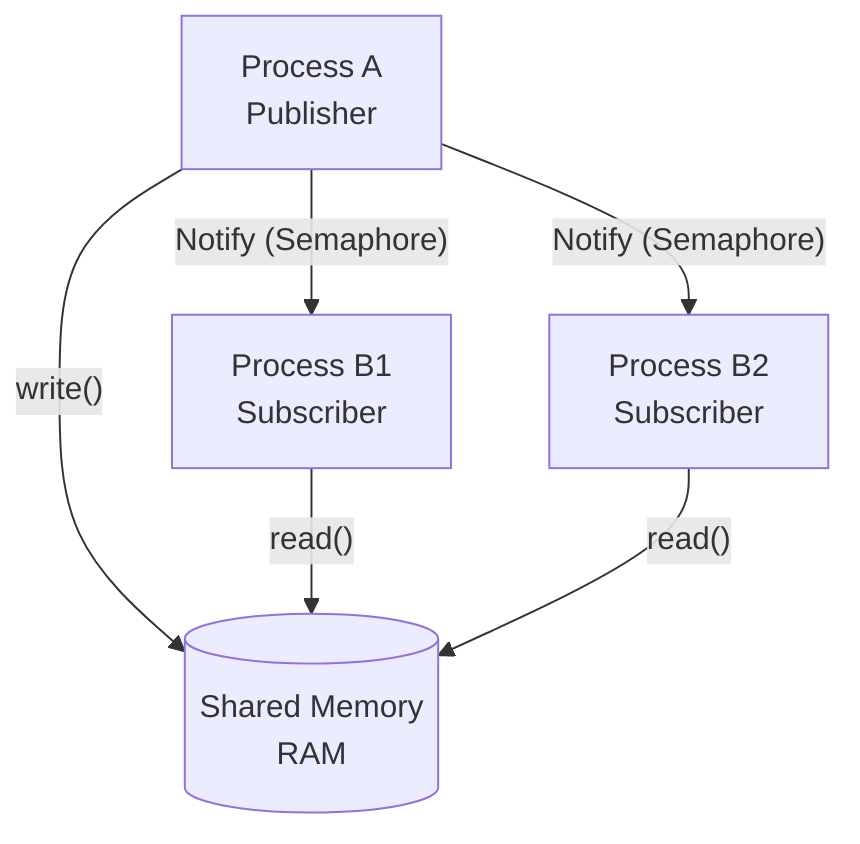

# Shared Memory

## 1. Overview



**Memory Mappings → Shared Memory → Using External Data Source as Shared Memory**



- Virtual Pages of both processes map to the **same physical pages** loaded in RAM.
- Physical Pages in turn are read/written to external memory.
- Any modification made by P1 in its shared Virtual Memory **shall be seen by P2**.

> **→ Used widely for IPC (no copying data → fastest IPC)**

## 2. Walk Steps

| Step | API | Description |
|------|-----|-------------|
| 1 | `shm_open()` | Initialize the Shared Memory segment |
| 2 | `ftruncate()` | Define the size of the SHM segment |
| 3 | `mmap()` | Map the SHM segment to Data Source |
| 4 | `read()` / `write()` | Use the Shared Memory |
| 5 | `munmap()` | Destroy the mapping between process and SHM |
| 6 | `shm_unlink()` | Destroy the shared memory segment |

## 3. Design Constraints for using Shared Memory as IPC

Shared Memory IPC is used in a scenario where:

- **Exactly one** process is responsible to update the shared memory (**Publisher**)
- Rest of the processes only **read** the shared memory (**Subscribers**)
- The frequency of updating should **not be very high** (e.g., user configures something on the software)

### Race Condition Problem

- Shared Memory **doesn't have built-in synchronization**.
- If multiple processes attempt to update at the same time → **write-write conflict** (Data Race).
- Solution: **Semaphore** (synchronization like Mutex but for multiple processes).

### Publisher-Subscriber Pattern



- Việc notify subscriber cũng sử dụng **Semaphore**.

## 4. Build Command

```bash
gcc -g example.c -lrt -lpthread -o example
```

> **Note:** Cần link `-lrt` (POSIX realtime) và `-lpthread` khi biên dịch.
