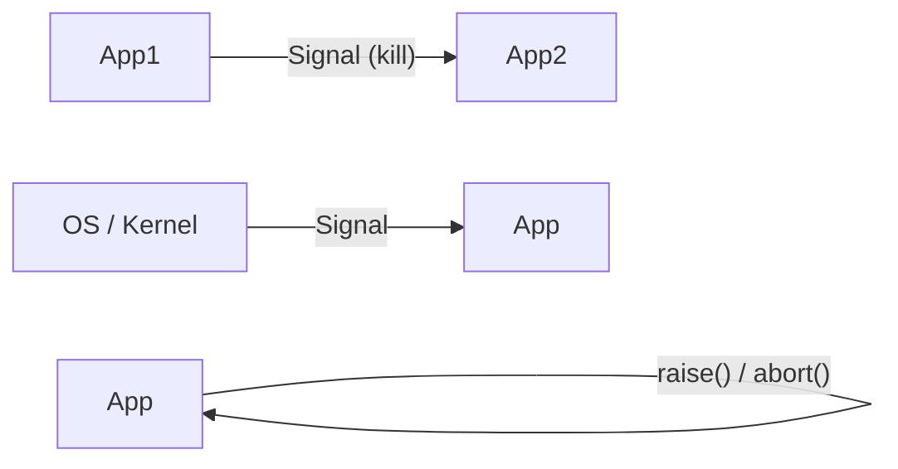
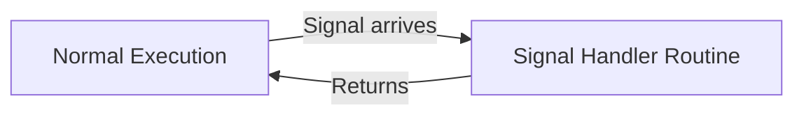

# Signals

## 1. Overview

- A **signal** is a system message sent from one process to another → **interrupt**.
- Not usually used to transfer data, instead used to **remotely command** the partnered process.
- Small message (1 or 2 bytes).

## 2. Signal Catching and Signal Handler Routine

When a process receives a signal, it can respond in 3 ways:

| Action | Description |
|--------|-------------|
| **Default** | Execute the default action (e.g., `SIGTERM` → process terminates) |
| **Customized** | Execute a user-defined **signal handler routine** (e.g., print "Goodbye" before dying) |
| **Ignore** | Process ignores the signal |

### Signal Handler Routine

- A signal handler is a special function invoked when the process receives a signal.
- The current thread **interrupts** the current function → jumps to signal handler.
- Signal handlers execute at **highest priority**, preempting the normal execution flow.

## 3. Linux Well-Known Signals

| Signal | Description |
|--------|-------------|
| `SIGINT` | Interrupt (i.e., `Ctrl+C`) |
| `SIGUSR1` / `SIGUSR2` | User-defined signals |
| `SIGKILL` | Sent from kernel when `kill -9` is invoked. **Cannot be caught** |
| `SIGABRT` | Raised by `abort()` by the process itself. **Cannot be blocked**. Process is terminated |
| `SIGTERM` | Raised when `kill` is invoked. **Can be caught** to execute user-defined action |
| `SIGSEGV` | Segmentation fault — raised by kernel when illegal memory is referenced |
| `SIGCHLD` | Sent to parent whenever a child terminates. Parent should call `wait()` to read child status |
